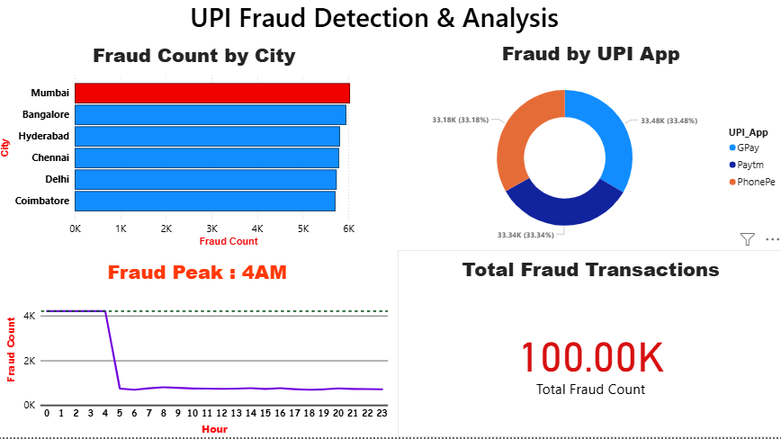

# UPI Fraud Analysis Dashboard

A Power BI based data analytics project to visualize and analyze UPI fraud patterns across cities, apps, and time using synthetic transaction data.

## 📊 Project Overview
UPI Fraud has become a major concern in India. This project analyzes over **100K synthetic UPI fraud transactions** to identify key patterns and trends. 
The dashboard helps to understand which cities, apps, and hours are most targeted by fraudsters.

**Objective**: To provide clear insights for fraud awareness and prevention using interactive data visualization.

## 🔍 Key Insights from Dashboard
Based on the analysis of `upi_fraud_sample.csv`:

1.  **Fraud Count by City**  
    **Mumbai** has the highest fraud count, followed by **Bangalore, Hyderabad, Chennai, Delhi, and Coimbatore**.
2.  **Fraud by UPI App**  
    Fraud cases are almost equally distributed: **GPay - 33.48%**, **Paytm - 33.34%**, **PhonePe - 33.18%**
3.  **Fraud Count by Hour**  
    Peak fraud activity occurs between **12 AM to 4 AM**. After 5 AM the fraud count drops significantly and remains low throughout the day.
4.  **Total Fraud Transactions**  
    The dataset contains **100.00K** total fraud cases.

## 📸 Dashboard Preview

*Dashboard built in Power BI Desktop showing Fraud by City, App, Hour and Total Count*

## 🛠️ Tech Stack
- **Data Processing & Cleaning**: Python, Pandas, NumPy, Jupyter Notebook
- **Data Visualization**: Power BI Desktop, 
- **Dataset**: `upi_fraud_sample.csv` - Synthetic UPI Transaction Data with 100K records

## 🚀 How to Run
Follow these steps to run the project on your system:

1.  **Clone this repository**
    ```bash
    git clone (https://github.com/parthiban-data/upi-fraud-detection-analysis.git)

## 7. 📁 Project Structure

Upi Fraud Detection&Analysis/
│
├── Data
|     ├──upi_fraud_data.csv
├── Dashboard.png
├── README.md
├── clean-data.ipynb
└── upi-analysis.pbix
      
## 👨‍💻 About Me
**Parthiban**  
Aspiring Data Scientist & Data Analyst | Python | Machine Learning | Streamlit

📍 Thanjavur, Tamil Nadu, India

Passionate about building data-driven solutions and deploying ML models into real-world applications. This project was built to strengthen my skills in EDA, Feature Engineering, and Model Deployment.

[[GitHub](https://github.com/)](https://github.com/parthiban-data/upi-fraud-detection-analysis.git) | [Live Demo](https://parthiban-data.github.io/upi-fraud-detection-analysis/)

If you liked this project, please give it a ⭐

---
**Made with ❤️ in India | 2026**

